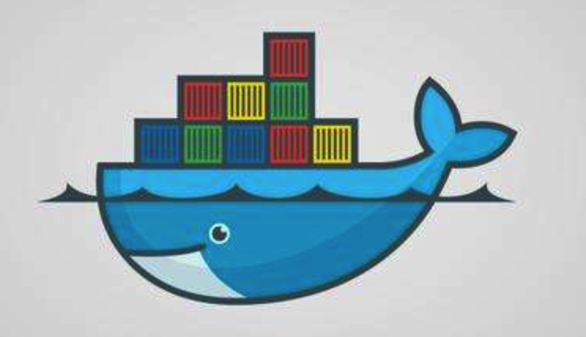

# Docker技术原理

> Auth: 王海飞
>
> Data：2020-09-04
>
> Email：779598160@qq.com
>
> github：https://github.com/coco369/knowledge

------

#### **先聊聊Docker 的基础内容：Docker 能做什么，怎么安装 Docker，以及容器技术的原理。**

### 1. Docker 能做什么？

​	众所周知，Docker 是一个用于开发，发布和运行应用程序的开放平台。通俗地讲，Docker 类似于集装箱。在一艘大船上，各种货物要想被整齐摆放并且相互不受到影响，我们就需要把各种货物进行集装箱标准化。有了集装箱，我们就不需要专门运输水果或者化学用品的船了。我们可以把各种货品通过集装箱打包，然后统一放到一艘船上运输。Docker 要做的就是把各种软件打包成一个集装箱（镜像），然后分发，且在运行的时候可以相互隔离。

到此，相信你已经迫不及待想要体验下了，下面就让我们来安装一个 Docker。



#### **2. CentOS 下安装 Docker**

​	Docker 是跨平台的解决方案，它支持在当前主流的各大平台安装，包括 Ubuntu、RHEL、CentOS、Debian 等 Linux 发行版，同时也可以在 OSX 、Microsoft Windows 等非 Linux 平台下安装使用。

​	因为 Linux 是 Docker 的原生支持平台，所以推荐你在 Linux 上使用 Docker。由于生产环境中我们使用 CentOS 较多，下面主要针对在 CentOS 平台下安装和使用 Docker 展开介绍。

##### 2.1 操作系统要求

要安装 Docker，我们需要 CentOS 7 及以上的发行版本。

##### 2.2 卸载已有 Docker
如果你已经安装过旧版的 Docker，可以先执行以下命令卸载旧版 Docker。

```
$ sudo yum remove docker \
				docker-client \
                docker-client-latest \
                docker-common \
                docker-latest \
                docker-latest-logrotate \
                docker-logrotate \
                docker-engine
```

##### 2.3 安装 Docker

首次安装 Docker 之前，需要添加 Docker 安装源。添加之后，我们就可以从已经配置好的源，安装和更新 Docker。添加 Docker 安装源的命令如下：

```
$ sudo yum-config-manager \
    --add-repo \
    https://download.docker.com/linux/centos/docker-ce.repo
```

正常情况下，直接安装最新版本的 Docker 即可，因为最新版本的 Docker 有着更好的稳定性和安全性。你可以使用以下命令安装最新版本的 Docker。

```
$ sudo yum install docker-ce docker-ce-cli containerd.io
```

安装完成后，使用以下命令启动 Docker。

```
$ sudo systemctl start docker
```

##### 2.4 启动一个 hello world 的容器

```
$ sudo docker run hello-world
Unable to find image 'hello-world:latest' locally
latest: Pulling from library/hello-world
0e03bdcc26d7: Pull complete
Digest: sha256:7f0a9f93b4aa3022c3a4c147a449bf11e0941a1fd0bf4a8e6c9408b2600777c5
Status: Downloaded newer image for hello-world:latest
Hello from Docker!
```

运行上述命令，Docker 首先会检查本地是否有`hello-world`这个镜像，如果发现本地没有这个镜像，Docker 就会去 **Docker Hub** 官方仓库下载此镜像，然后运行它。最后我们看到该镜像输出 "Hello from Docker!" 并退出。

> 安装完成后默认 docker 命令只能以 root 用户执行，如果想允许普通用户执行 docker 命令，需要执行以下命令 sudo groupadd docker && sudo gpasswd -a ${USER} docker && sudo systemctl restart docker ，执行完命令后，退出当前命令行窗口并打开新的窗口即可。

安装完 Docker，先不着急使用，先来了解下容器的技术原理，这样才能知其所以然。