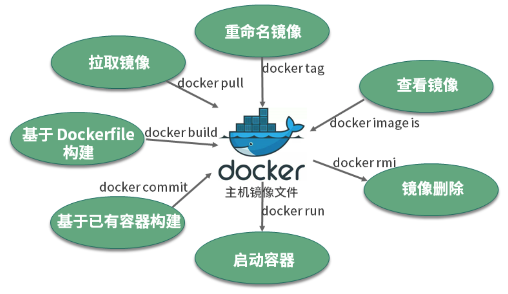

# Docker镜像配置与原理

> Auth: 王海飞
>
> Data：2020-09-011
>
> QQ群：223058292
>
> WX：wanghaifeige
>
> Email：779598160@qq.com
>
> github：https://github.com/coco369/docker-depth-learning
>
> 知乎Docker专栏：<https://zhuanlan.zhihu.com/c_1285288092883734528>
>
> 知乎Python入门专栏：<https://zhuanlan.zhihu.com/c_1277570999509757952>

------

​	Docker 核心：镜像，首先重点讲解一下镜像的基本操作，然后介绍一下镜像的实现原理。

### 1. 镜像	

​	镜像是一个只读的 Docker 容器模板，包含启动容器所需要的所有文件系统结构和内容。简单来讲，**镜像是一个特殊的文件系统**，它提供了容器运行时所需的程序、软件库、资源、配置等静态数据。即镜像不包含任何动态数据，镜像内容在构建后不会被改变。

如何操作镜像：



从图中可知，镜像的操作可分为：

​	拉取镜像，使用docker pull命令拉取远程仓库的镜像到本地 ；

​	重命名镜像，使用docker tag命令“重命名”镜像 ；

​	查看镜像，使用docker image ls或docker images命令查看本地已经存在的镜像 ；

​	删除镜像，使用docker rmi命令删除无用镜像 ；

​	构建镜像，构建镜像有两种方式。第一种方式是使用docker build命令基于 Dockerfile 构建镜像，也是我比较推荐的镜像构建方式；第二种方式是使用docker commit命令基于已经运行的容器提交为镜像。

#### **1.1 拉取镜像**

Docker 镜像的拉取使用**docker pull命令**， 命令格式一般为 **docker pull [Registry]/[Repository]/[Image]:[Tag]**。

- Registry 为注册服务器，Docker 默认会从 docker.io 拉取镜像，如果你有自己的镜像仓库，可以把 Registry 替换为自己的注册服务器。

- Repository 为镜像仓库，通常把一组相关联的镜像归为一个镜像仓库，library为 Docker 默认的镜像仓库。

- Image 为镜像名称。

- Tag 为镜像的标签，如果你不指定拉取镜像的标签，默认为latest。


例如，我们需要获取一个 busybox 镜像，可以执行以下命令：

busybox 是一个集成了数百个 Linux 命令（例如 curl、grep、mount、telnet 等）的精简工具箱，只有几兆大小，被誉为 Linux 系统的瑞士军刀。我经常会使用 busybox 做调试来查找生产环境中遇到的问题。

```
$ docker pull busybox
Using default tag: latest
latest: Pulling from library/busybox
61c5ed1cbdf8: Pull complete
Digest: sha256:4f47c01fa91355af2865ac10fef5bf6ec9c7f42ad2321377c21e844427972977
Status: Downloaded newer image for busybox:latest
docker.io/library/busybox:latest
```

​	实际上执行docker pull busybox命令，都是先从本地搜索，如果本地搜索不到busybox镜像则从 Docker Hub 下载镜像。

#### 1.2 操作镜像

##### 查看镜像

Docker 镜像查看使用**docker images或者docker image ls**命令。

下面我们使用docker images命令列出本地所有的镜像。

```
$ docker images
REPOSITORY          TAG                 IMAGE ID            CREATED             SIZE
nginx               latest              4bb46517cac3        9 days ago          133MB
nginx               1.15                53f3fd8007f7        15 months ago       109MB
busybox             latest              018c9d7b792b        3 weeks ago         1.22MB
```

如果我们想要查询指定的镜像，可以使用docker image ls命令来查询。

```
$ docker image ls busybox
REPOSITORY          TAG                 IMAGE ID            CREATED             SIZE
busybox             latest              018c9d7b792b        3 weeks ago         1.22MB
```

当然你也可以使用docker images命令列出所有镜像，然后使用grep命令进行过滤。使用方法如下：

```
$ docker images |grep busybox
busybox             latest              018c9d7b792b        3 weeks ago         1.22MB
```


**“重命名”镜像**

如果你想要自定义镜像名称或者推送镜像到其他镜像仓库，你可以使用docker tag命令将镜像重命名。docker tag的命令格式为 docker tag [SOURCE_IMAGE][:TAG] [TARGET_IMAGE][:TAG]。

```
$ docker tag busybox:latest mybusybox:latest
```

执行完docker tag命令后，可以使用查询镜像命令查看一下镜像列表：

```
docker images
REPOSITORY          TAG                 IMAGE ID            CREATED             SIZE
busybox             latest              018c9d7b792b        3 weeks ago         1.22MB
mybusybox           latest              018c9d7b792b        3 weeks ago         1.22MB
```

可以看到，镜像列表中多了一个mybusybox的镜像。busybox和mybusybox这两个镜像的 IMAGE ID 是完全一样的。为什么呢？实际上它们指向了同一个镜像文件，只是别名不同而已。

##### 删除镜像

你可以使用**docker rmi或者docker image rm**命令删除镜像。

例：删除mybusybox镜像

```
$ docker rmi mybusybox
此时，再次使用docker images命令查看一下我们机器上的镜像列表。

$ docker images
REPOSITORY          TAG                 IMAGE ID            CREATED             SIZE
busybox             latest              018c9d7b792b        3 weeks ago         1.22MB
通过上面的输出，我们可以看到，mybusybox镜像已经被删除。
```

##### **构建镜像**

构建镜像主要有两种方式：

- **docker commit**命令从运行中的容器提交为镜像；
- **docker build**命令从 Dockerfile 构建镜像。


**Docker commit命令**

首先介绍下如何从运行中的容器提交为镜像。我依旧使用 busybox 镜像举例，使用以下命令创建一个名为 busybox 的容器并进入 busybox 容器。

```
# 创建容器
$ docker run -itd busybox

# 进入容器
$ docker exec -it 容器id /binn/bash
```

执行完上面的命令后，当前窗口会启动一个 busybox 容器并且进入容器中。在容器中，执行以下命令创建一个文件并写入内容：

```
touch hello.txt && echo "I love Docker. " > hello.txt
```

此时在容器的根目录下，已经创建了一个 hello.txt 文件，并写入了 "I love Docker. "。下面，我们新打开另一个命令行窗口，运行以下命令提交镜像：

```
$ docker commit busybox busybox:hello
sha256:cbc6406aaef080d1dd3087d4ea1e6c6c9915ee0ee0f5dd9e0a90b03e2215e81c
```

然后使用上面讲到的docker image ls命令查看镜像：

```
$ docker image ls busybox
REPOSITORY          TAG                 IMAGE ID            CREATED             SIZE
busybox             hello               cbc6406aaef0        2 minutes ago       1.22MB
busybox             latest              018c9d7b792b        4 weeks ago         1.22MB
```

此时我们可以看到主机上新生成了 busybox:hello 这个镜像。


**Docker build命令**

最常用的镜像构建方式：Dockerfile。Dockerfile 是一个包含了用户所有构建命令的文本。**通过docker build命令可以从 Dockerfile 生成镜像。**

使用 Dockerfile 构建镜像具有以下特性：

- Dockerfile 的每一行命令都会生成一个独立的镜像层，并且拥有唯一的 ID；

- Dockerfile 的命令是完全透明的，通过查看 Dockerfile 的内容，就可以知道镜像是如何一步步构建的；

- Dockerfile 是纯文本的，方便跟随代码一起存放在代码仓库并做版本管理。


先学习下 Dockerfile 常用的指令。

Dockerfile 指令	指令简介

- FROM	Dockerfile 除了注释第一行必须是 FROM ，FROM 后面跟镜像名称，代表我们要基于哪个基础镜像构建我们的容器。（ **默认会先从本地去查找镜像**）
- RUN	RUN 后面跟一个具体的命令，类似于 Linux 命令行执行命令。
- ADD	拷贝本机文件或者远程文件到镜像内
- COPY	拷贝本机文件到镜像内
- USER	指定容器启动的用户
- ENTRYPOINT	容器的启动命令
- CMD	CMD 为 ENTRYPOINT 指令提供默认参数，也可以单独使用 CMD 指定容器启动参数
- ENV	指定容器运行时的环境变量，格式为 key=value
- ARG	定义外部变量，构建镜像时可以使用 build-arg = 的格式传递参数用于构建
- EXPOSE	指定容器监听的端口，格式为 [port]/tcp 或者 [port]/udp
- WORKDIR	为 Dockerfile 中跟在其后的所有 RUN、CMD、ENTRYPOINT、COPY 和 ADD 命令设置工作目录。


先分析下如下Dockerfile文件中的含义：

```dockerfile
FROM centos:7
COPY nginx.repo /etc/yum.repos.d/nginx.repo
RUN yum install -y nginx
EXPOSE 80
ENV HOST=mynginx
CMD ["nginx","-g","daemon off;"]
```

- 第一行表示我要基于 centos:7 这个镜像来构建自定义镜像。这里需要注意，每个 Dockerfile 的第一行除了注释都必须以 FROM 开头。

- 第二行表示拷贝本地文件 nginx.repo 文件到容器内的 /etc/yum.repos.d 目录下。这里拷贝 nginx.repo 文件是为了添加 nginx 的安装源。

- 第三行表示在容器内运行yum install -y nginx命令，安装 nginx 服务到容器内，执行完第三行命令，容器内的 nginx 已经安装完成。

- 第四行声明容器内业务（nginx）使用 80 端口对外提供服务。

- 第五行定义容器启动时的环境变量 HOST=mynginx，容器启动后可以获取到环境变量 HOST 的值为 mynginx。

- 第六行定义容器的启动命令，命令格式为 json 数组。这里设置了容器的启动命令为 nginx ，并且添加了 nginx 的启动参数 -g 'daemon off;' ，使得 nginx 以前台的方式启动。


上面这个 Dockerfile 的例子基本涵盖了常用的镜像构建指令。

### 2. 镜像的实现原理

#### 2.1 Docker分层

